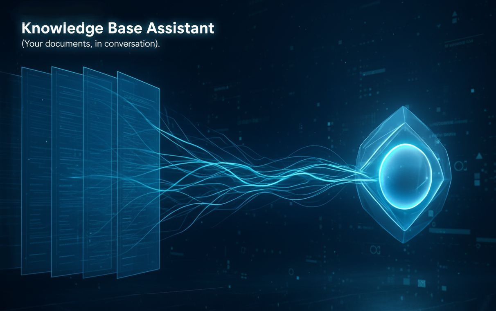

# Knowledge Base Assistant

A Retrieval-Augmented Generation (RAG) application that transforms your internal technical documents into an interactive and intelligent Q&A system.

<p align="center">
  
</p>

## The Problem

Engineers, researchers, and subject matter experts often face the challenge of navigating dense and lengthy technical documents. Finding specific information is time-consuming, and critical knowledge remains siloed within complex PDFs, hindering productivity and knowledge sharing.

## The Solution

The Knowledge Base Assistant provides a powerful conversational AI that ingests these documents and allows users to ask questions in natural language. It makes complex information instantly accessible and actionable, turning your static knowledge base into a dynamic conversation partner.

This project was developed as a Final Master's Thesis for the *Master in Data Science, Big Data & Business Analytics* (UCM-ntic, 2024-2025).

## Key Features

✨ **Modern Web Interface:** A clean, responsive web interface with real-time chat functionality, multi-language support (English, Spanish, Italian), and integrated user feedback collection.

📊 **Embedded Grafana Dashboard:** Live, interactive system monitoring with 7 comprehensive panels displaying conversations, feedback, costs, response times, and model usage - all embedded directly in the web UI.

🖥️ **Interactive CLI:** A powerful command-line interface with rich terminal output, system health metrics display, random question testing, and comprehensive monitoring controls.

🌐 **Multi-Language Support:** Full internationalization with Flask-Babel, supporting English, Spanish, and Italian for both queries and UI elements.

📈 **Comprehensive Monitoring:** Real-time logging of conversations, performance metrics, cost tracking, and user feedback to PostgreSQL database with automated Grafana visualization.

🐳 **Production-Ready Deployment:** Complete containerized stack with Docker Compose, including automated database initialization, health checks, and service dependencies.

🔍 **Intelligent Query Routing:** Smart LLM-based routing system that determines context relevance and handles both content queries and metadata queries appropriately.

📊 **Advanced Analytics:** Built-in system health endpoints, conversation statistics, feedback analysis, and cost monitoring accessible via API and CLI.


## Live Demo & Screenshots

Below is a screenshot of the main web interface, showing the chat application alongside the embedded, real-time Grafana monitoring dashboard.

<p align="center">
  
</p>

Watch a full video demo of the project, including setup and usage instructions:

<p align="center">
  <a href="https://www.youtube.com/watch?v=RiQcSHzR8_E">
    
  </a>
</p>


## Project Overview

The Knowledge Base Assistant is a sophisticated RAG (Retrieval-Augmented Generation) application that transforms technical document libraries into intelligent, conversational interfaces. Built as a Master's thesis project, it demonstrates production-ready AI application development with comprehensive monitoring and multi-modal access.

**Current Implementation:** This MVP focuses on Oil & Gas industry technical publications, specifically SPE (Society of Petroleum Engineers) papers covering organizational behavior management and human performance. However, the architecture is designed for adaptability across any technical domain.

The system intelligently routes queries through multiple retrieval strategies:

1. **Domain-Specific Knowledge Retrieval:** Answers questions directly related to the technical content within the document library using semantic and full-text search.
2. **Intelligent Query Routing:** Uses an LLM router to determine context relevance and gracefully handles out-of-scope queries.
3. **Metadata Discovery:** Efficiently handles bibliographic queries about authors, publication years, and document details.
4. **Multi-Modal Access:** Provides both intuitive web interface and powerful CLI for different user workflows.
5. **Production Monitoring:** Tracks system performance, costs, user satisfaction, and provides real-time analytics.


## Dataset

The dataset used in this project is a collection of technical papers in PDF format. The ETL (Extract, Transform, Load) pipeline processes these documents and converts them into a structured JSONL format, where each record represents a "chunk" of information.

Each chunk record contains:

-   **Document Metadata:** Information about the entire source document, including:
    -   `title`: The title of the paper.
    -   `authors`: A list of the paper's authors.
    -   `year`: The publication year.
    -   `abstract`: A summary of the paper's abstract.
-   **Chunk Data:** Information specific to that piece of text:
    -   `chunk_id`: A unique identifier for the chunk.
    -   `section_title`: The section of the paper the chunk belongs to.
    -   `page_number`: The page number where the chunk originated.
    -   `content`: The raw text of the chunk.
-   **Embedding:** A vector representation of the content for semantic search capabilities.

The final, processed dataset serves as the knowledge base for the assistant.

You can find the data stored in JSONL format in [`data/data.jsonl`](data/data.jsonl).

## Technologies

- **Python 3.12** - Core application runtime
- **Docker and Docker Compose** - Containerization and orchestration
- **[Minsearch](https://github.com/alexeygrigorev/minsearch)** - In-memory full-text search engine
- **Flask** - Web framework and API interface
- **Flask-Babel** - Internationalization and multi-language support
- **Gunicorn** - Production WSGI HTTP server
- **PostgreSQL** - Database for conversation logs and monitoring data
- **Grafana** - Real-time monitoring dashboards and analytics
- **OpenAI API** - Large Language Model integration
- **Flasgger** - API documentation with Swagger UI

## Preparation

### Required Setup

1. **OpenAI API Key**: You need an OpenAI API key for the LLM functionality.
   - Create a new project in your OpenAI account and generate a separate API key
   - Copy `.envrc_template` to `.env` and update the values
   - Replace `YOUR_KEY` with your actual OpenAI API key

2. **Docker and Docker Compose**: Required for running the application stack.
   - Install Docker and Docker Compose on your system
   - Ensure Docker daemon is running

### Environment Configuration

Copy the template and update the required values:

```bash
cp .envrc_template .env
```

Edit the `.env` file and replace the placeholder values:

**Required Variables:**
```bash
# Application (REQUIRED)
OPENAI_API_KEY='your-openai-api-key-here'

# Grafana (REQUIRED - set your own secure password)
GRAFANA_ADMIN_PASSWORD='your-secure-password'
```

**Optional Variables (have sensible defaults):**
```bash
# PostgreSQL (can keep defaults)
POSTGRES_DB=knowledge_base_assistant
POSTGRES_USER=user
POSTGRES_PASSWORD=password
POSTGRES_PORT=5432

# Application settings
APP_PORT=8000
TZ=Europe/Berlin  # Change to your timezone

# Grafana
GRAFANA_ADMIN_USER=admin
GRAFANA_DASHBOARD_UID='YOUR_UID'  # Auto-generated by system
```

**Note:** The `GRAFANA_DASHBOARD_UID` is automatically set during initialization, so you can leave the placeholder value.

### Python Dependencies (for local development)

For local development outside Docker, install pipenv:

```bash
pip install pipenv
pipenv install --dev
```

## Running the Application

### Quick Start with Docker Compose (Recommended)

The simplest way to run the complete application stack:

```bash
# First time setup - builds images and initializes database
docker-compose up --build -d

# Check all services are running
docker-compose ps

# Access the application
# Web UI: http://localhost:8000
# Grafana: http://localhost:3000 (admin/admin)
```

**Important**: The database is reset each time you run `docker-compose down` followed by `docker-compose up`. For subsequent startups that preserve your data, use:

```bash
# Restart existing containers (preserves database)
docker-compose up -d
```

### Running Locally (Development)

If you want to run the application locally for development:

```bash
# Start only PostgreSQL and Grafana
docker-compose up postgres grafana -d

# Stop the containerized app if it's running
docker-compose stop app

# Set up local environment
pipenv shell
cd knowledge_base_assistant

# Initialize database (first time only)
export POSTGRES_HOST=localhost
python db_prep.py

# Run the Flask development server
python app.py
```

The application will be available at `http://localhost:5000` (Flask dev server) while Grafana remains at `http://localhost:3000`.

### Accessing the Database

To inspect the database directly:

```bash
# Install pgcli (if not already installed)
pip install pgcli

# Connect to database
pgcli -h localhost -U user -d knowledge_base_assistant -W
```

Example queries:
```sql
-- View conversation count
SELECT COUNT(*) FROM conversations;

-- View recent conversations
SELECT question, answer, timestamp FROM conversations ORDER BY timestamp DESC LIMIT 5;

-- View feedback
SELECT conversation_id, feedback FROM feedback;
```

### Stopping the Application

```bash
# Stop services (preserves data)
docker-compose stop

# Stop and remove containers (preserves data volumes)
docker-compose down

# Stop and remove everything including data (⚠️ DATA LOSS)
docker-compose down -v
```


## Using the Application

### Web Interface

The primary way to interact with the Knowledge Base Assistant is through the web interface:

1. **Access the Application**: Open `http://localhost:8000` in your browser
2. **Multi-language Support**: Use the language switcher (English/Español/Italiano) in the top-right corner
3. **Ask Questions**: Type your question in the input field and click "Ask"
4. **View Sources**: Expand the source details to see the specific documents and sections used
5. **Provide Feedback**: Use the 👍/👎 buttons to rate answer quality
6. **Monitor System**: Scroll down to view real-time Grafana dashboards embedded in the interface

### Interactive CLI

For power users and testing, use the command-line interface:

```bash
# cli.py uses BASE_URL from .env (default: http://localhost:8000)

# Basic interactive mode
python cli.py

# Test with random question from ground truth dataset
python cli.py --random

# Custom ground truth file
python cli.py --file path/to/your/questions.csv
```

**CLI Features:**
- System health metrics display
- Rich terminal formatting
- Conversation feedback collection
- Random question testing from ground truth data
- Detailed monitoring metrics per request

### Direct RAG Module (Advanced)

For direct access to the RAG pipeline without web interface:

```bash
# Basic query (English)
pipenv shell
python -m knowledge_base_assistant.rag "Your question here"

# Multi-language queries
python -m knowledge_base_assistant.rag --lang es "¿Cuál es el tema principal?"
python -m knowledge_base_assistant.rag --lang it "Chi sono gli autori?"

# With detailed evaluation metrics
python -m knowledge_base_assistant.rag "Your question" --evaluate
```

### API Integration

The Flask API provides programmatic access with full monitoring capabilities:

#### 1. Ask Questions

```bash
curl -X POST http://localhost:8000/ask \
  -H "Content-Type: application/json" \
  -d '{"question": "What are the main safety challenges in oil and gas?"}'
```

Response includes answer, sources, conversation ID, and detailed metrics.

#### 2. Submit Feedback

```bash
curl -X POST http://localhost:8000/feedback \
  -H "Content-Type: application/json" \
  -d '{"conversation_id": "your-conversation-id", "feedback": 1}'
```

Use `1` for positive feedback, `-1` for negative.

#### 3. System Statistics

```bash
# Conversation statistics
curl "http://localhost:8000/stats/conversations?days=7"

# Feedback summary
curl "http://localhost:8000/stats/feedback"

# Health check
curl "http://localhost:8000/health"
```

### Testing with Random Questions

Use the included test script to validate system functionality:

```bash
# Test with random question from ground truth dataset
python test.py
```

This script automatically selects a question from `data/ground-truth-retrieval.csv` and displays the complete API response including metrics and context sources.


## Code

The application code is organized in the [`knowledge_base_assistant`](knowledge_base_assistant/) folder with a modular architecture supporting both web and API interfaces:

### Core Application Files

- [`app.py`](knowledge_base_assistant/app.py) - Flask application with web UI, API endpoints, and internationalization support. Includes routes for chat interface, feedback collection, system statistics, and health monitoring.
- [`rag.py`](knowledge_base_assistant/rag.py) - Main RAG pipeline with intelligent query routing, multi-language support, cost tracking, and LLM-based relevance evaluation.
- [`db.py`](knowledge_base_assistant/db.py) - Database operations including conversation logging, feedback storage, analytics queries, and comprehensive monitoring metrics.
- [`ingest.py`](knowledge_base_assistant/ingest.py) - Data loading and preprocessing pipeline for converting document chunks into searchable format.
- [`minsearch.py`](knowledge_base_assistant/minsearch.py) - Custom in-memory search engine optimized for semantic and full-text retrieval.

### Database and Infrastructure

- [`db_prep.py`](knowledge_base_assistant/db_prep.py) - Database schema initialization script that creates tables with enhanced monitoring fields.

### Internationalization

- [`babel.cfg`](knowledge_base_assistant/babel.cfg) - Babel configuration for multi-language support
- [`messages.pot`](knowledge_base_assistant/messages.pot) - Translation template file
- [`translations/`](knowledge_base_assistant/translations/) - Compiled language files for English, Spanish, and Italian
- [`templates/`](knowledge_base_assistant/templates/) - Jinja2 templates with internationalized web interface

### Testing and Development

- [`rag-test.py`](knowledge_base_assistant/rag-test.py) - Development testing script for RAG pipeline evaluation and debugging

### Root Directory Files

- [`cli.py`](cli.py) - Interactive command-line interface with system health monitoring and rich terminal output
- [`test.py`](test.py) - API testing script that selects random questions from ground truth dataset
- [`gunicorn.conf.py`](gunicorn.conf.py) - Production server configuration

### Interface Architecture

The application provides multiple access methods:

1. **Web Interface**: Modern responsive UI with embedded Grafana dashboards, multi-language support, and real-time chat functionality
2. **REST API**: Complete programmatic access with detailed metrics and monitoring
3. **CLI Interface**: Interactive terminal application with system health displays and testing capabilities
4. **Direct Module Access**: Command-line access to RAG pipeline for advanced users

### Monitoring Integration

The application includes comprehensive observability:
- Real-time conversation logging with detailed metrics
- Cost tracking and token usage monitoring  
- User feedback collection and analysis
- Performance metrics and response time tracking
- Embedded Grafana dashboards for live system monitoring


## Experiments

The evaluation methodology has evolved significantly during development to accommodate the sophisticated RAG pipeline with intelligent query routing, multi-language support, and comprehensive monitoring capabilities.

### Jupyter Notebooks

Experiments are conducted using Jupyter notebooks in the [`notebooks`](notebooks/) folder:

```bash
cd notebooks
pipenv run jupyter notebook
```

**Available Notebooks:**

- [`rag-test.ipynb`](notebooks/rag-test.ipynb): Comprehensive RAG pipeline evaluation including query routing effectiveness, multi-language performance, cost analysis, and end-to-end system testing with the enhanced monitoring framework.

- [`evaluation-data-generation.ipynb`](notebooks/evaluation-data-generation.ipynb): Ground truth dataset generation for retrieval evaluation, including question formulation, answer validation, and relevance assessment for the Oil & Gas domain technical documents.

### Evaluation Datasets

The evaluation framework uses several datasets stored in the [`data`](data/) directory:

- **`ground-truth-retrieval.csv`**: Curated question-answer pairs for retrieval evaluation
- **`rag-eval-gpt-4o-mini.csv`**: Comprehensive RAG evaluation results with LLM-as-Judge metrics
- **`data.jsonl`**: Complete processed knowledge base with embeddings and metadata

### Evaluation Methodology

The system employs a multi-dimensional evaluation approach:

#### 1. Retrieval Performance
- **Semantic Search Effectiveness**: Evaluation of context relevance and ranking
- **Query Routing Accuracy**: Assessment of the LLM router's ability to distinguish relevant vs. irrelevant queries
- **Metadata Query Handling**: Performance on bibliographic and document-metadata queries

#### 2. RAG Pipeline Evaluation
- **LLM-as-Judge Assessment**: Using GPT-4o-mini for answer relevance evaluation
- **Multi-language Performance**: Evaluation across English, Spanish, and Italian queries  
- **Cost-Effectiveness Analysis**: Token usage and cost tracking per query type

#### 3. Production Metrics
- **Response Time Analysis**: End-to-end latency measurement
- **User Feedback Integration**: Real-world relevance assessment from user interactions
- **System Health Monitoring**: Performance tracking through embedded Grafana dashboards

### Current Performance Baseline

The enhanced system with intelligent query routing demonstrates:
- Improved handling of out-of-domain queries through graceful fallback mechanisms
- Multi-language query processing with automatic translation and localized responses
- Comprehensive cost tracking with per-conversation metrics
- Real-time performance monitoring integrated into the user interface

*Note: Specific numerical metrics are continuously updated through the live monitoring system and can be accessed via the system statistics endpoints or Grafana dashboards.*

## Monitoring

The Knowledge Base Assistant includes comprehensive real-time monitoring through embedded Grafana dashboards, providing instant visibility into system performance, user interactions, and operational metrics.

### Access Methods

**Primary Access - Embedded Dashboards:**
- Integrated directly into the web interface at [http://localhost:8000](http://localhost:8000)
- Scroll down in the main application to view live monitoring panels
- No separate login required - dashboards are embedded seamlessly

**Standalone Access (Advanced Users):**
- Direct Grafana interface at [http://localhost:3000](http://localhost:3000)
- Login credentials:
  - Username: `admin` 
  - Password: Set in your `.env` file as `GRAFANA_ADMIN_PASSWORD`

### Dashboard Panels

The monitoring system provides six key panels for comprehensive system oversight:

<p align="center">
  
</p>

#### 1. **Last 5 Conversations (Table)**
Displays the most recent user interactions with detailed information:
- **Question**: User's original query
- **Answer**: System's response summary  
- **Relevance**: Automated relevance assessment (RELEVANT, PARTLY_RELEVANT, NON_RELEVANT)
- **Timestamp**: Exact time of interaction

This panel helps monitor recent user engagement and response quality in real-time.

#### 2. **+1/-1 Feedback (Pie Chart)** 
Visual representation of user satisfaction through thumbs up/down feedback:
- **Green**: Positive feedback (thumbs up)
- **Red**: Negative feedback (thumbs down)
- **Percentage breakdown** of user satisfaction rates

Essential for tracking user experience and system effectiveness.

#### 3. **Relevancy (Gauge Charts)**
Three separate gauge visualizations showing the distribution of response relevance:
- **NON_RELEVANT**: Responses that didn't address the user's question
- **PARTLY_RELEVANT**: Responses with partial relevance to the query
- **RELEVANT**: Fully relevant and helpful responses

Color-coded gauges (green for good, red for concerning) provide immediate visual feedback on system performance quality.

#### 4. **OpenAI Cost (Time Series)**
Real-time tracking of API usage costs over time:
- **Cost per conversation** in USD
- **Cumulative spending trends**
- **Usage spike identification**

Critical for budget monitoring and understanding operational expenses.

#### 5. **Model Used (Bar Chart)**
Distribution of AI models used across conversations:
- **gpt-4o-mini**: Most frequently used model for cost-effectiveness
- **Other models**: Usage patterns for different model types
- **Model performance correlation** with relevance metrics

Helps understand model usage patterns and optimize model selection.

#### 6. **Response Time (Time Series)**
System performance monitoring showing:
- **End-to-end response latency** 
- **Performance trends over time**
- **System bottleneck identification**

Essential for maintaining optimal user experience and identifying performance issues.

### Database Schema

The monitoring system uses a robust PostgreSQL schema:

**Conversations Table:**
```sql
- id, question, answer, context
- model_used, response_time, relevance
- prompt_tokens, completion_tokens, total_tokens
- eval_prompt_tokens, eval_completion_tokens, eval_total_tokens  
- openai_cost, user_language, timestamp
```

**Feedback Table:**
```sql
- id, conversation_id, feedback (-1 or +1), timestamp
```

### Accessing Raw Monitoring Data

For advanced analysis, connect directly to the PostgreSQL database:

```bash
# Install pgcli (if not already installed)
pip install pgcli

# Connect to the monitoring database
pgcli -h localhost -U user -d knowledge_base_assistant -W
```

**Useful Monitoring Queries:**
```sql
-- Recent conversation metrics
SELECT question, relevance, openai_cost, response_time 
FROM conversations 
ORDER BY timestamp DESC LIMIT 10;

-- Daily cost analysis
SELECT DATE(timestamp) as date, 
       ROUND(SUM(openai_cost), 4) as daily_cost,
       COUNT(*) as conversations
FROM conversations 
GROUP BY DATE(timestamp) 
ORDER BY date DESC;

-- User satisfaction rates
SELECT 
  SUM(CASE WHEN feedback = 1 THEN 1 ELSE 0 END) as positive,
  SUM(CASE WHEN feedback = -1 THEN 1 ELSE 0 END) as negative,
  ROUND(AVG(CASE WHEN feedback = 1 THEN 1.0 ELSE 0.0 END) * 100, 2) as satisfaction_rate
FROM feedback;
```

### Grafana Configuration

The Grafana setup is managed through the [`grafana`](grafana/) folder:

- [`init.py`](grafana/init.py) - Dashboard and datasource initialization script
- [`dashboard.json`](grafana/dashboard.json) - Complete dashboard configuration
- [`provisioning/`](grafana/provisioning/) - Automated Grafana provisioning

The dashboard configuration is automatically initialized when the application starts, ensuring consistent monitoring setup across deployments.

### Monitoring Integration

The monitoring system is fully integrated into the application architecture:

- **Automatic Data Collection**: Every conversation automatically logs comprehensive metrics
- **Real-time Updates**: Dashboards refresh automatically to show live data
- **Cost Tracking**: Precise OpenAI API cost calculation per interaction
- **Performance Metrics**: Response time and token usage monitoring
- **User Feedback Integration**: Direct correlation between user satisfaction and system metrics

This embedded monitoring approach ensures that system health and performance insights are immediately available to users and administrators without requiring separate tools or interfaces.

## Background

This section provides background information on key technologies used in the Knowledge Base Assistant and resources for further exploration.

### Flask Web Framework

Flask serves as the foundation for both the web interface and REST API endpoints. It provides:

- **Lightweight Web Framework**: Minimal overhead with powerful extensibility
- **API Development**: RESTful endpoints for programmatic access
- **Template Engine**: Jinja2 integration for dynamic web pages
- **Internationalization**: Flask-Babel support for multi-language interfaces

The application uses Flask's modular approach to separate concerns between web UI, API routes, and core RAG functionality.

**Further Reading**: [Official Flask Documentation](https://flask.palletsprojects.com/)

### Docker Compose Orchestration

Docker Compose manages the multi-service architecture, coordinating:

- **Application Container**: Main Flask application with Gunicorn
- **PostgreSQL Database**: Persistent data storage for conversations and feedback
- **Grafana Monitoring**: Real-time dashboards and visualization

**Key Docker Compose Commands**:
```bash
# Start all services
docker-compose up -d

# View service status  
docker-compose ps

# View service logs
docker-compose logs -f app

# Stop services (preserve data)
docker-compose stop

# Stop and remove containers (preserve volumes)
docker-compose down

# Complete cleanup (⚠️ deletes all data)
docker-compose down -v
```

**Further Reading**: [Docker Compose Documentation](https://docs.docker.com/compose/)

### RAG Architecture Concepts

The Retrieval-Augmented Generation implementation combines:

- **Semantic Search**: Vector embeddings for context-aware retrieval
- **Full-Text Search**: Traditional keyword-based search capabilities  
- **Query Routing**: LLM-based relevance assessment and routing
- **Multi-Language Support**: Automatic translation and localized responses

Understanding these concepts helps optimize query formulation and interpret system responses.

**Further Reading**: 
- [RAG Overview](https://arxiv.org/abs/2005.11401)
- [OpenAI Embeddings Guide](https://platform.openai.com/docs/guides/embeddings)

## Acknowledgements 

This project was developed as a Final Master's Thesis for the *Data Science, Big Data & Business Analytics Masters Program* (UCM-ntic, 2024-2025).

Special recognition goes to **DataTalks.Club** and their **LLM Zoomcamp: Real-Life Applications of LLMs** course, which provided the foundational framework and methodology that served as the primary reference for this implementation. The course's practical approach to building production-ready RAG applications was instrumental in shaping the architecture and best practices demonstrated in this project.

I wish to thank the UCM-ntic staff for their exceptional organization and insightful curriculum. The comprehensive program provided a vital foundation and ignited a passion for further exploration into Data Science, AI, and state-of-the-art technologies.